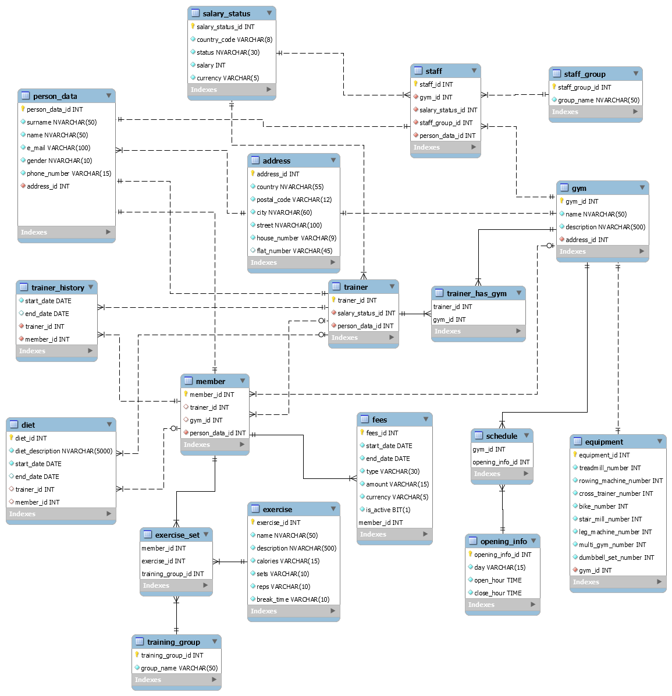

# gym_db_mysql

##### Database for gym networks - created as part of the Advanced Database Systems subject as part of the Computer Science WUT course.

Diagram (below) was created Using MySQL Workbench. 

`CREATE.sql` file, which creates the database, was generated using MySQL Workbench Forward Engineering. 

`Fill.sql` is used to fill the database with sample data.

##### *Events*, *indexes*, *functions*, *procedures*, *triggers* and *views* were created. Code posted in the appropriate repo folders.